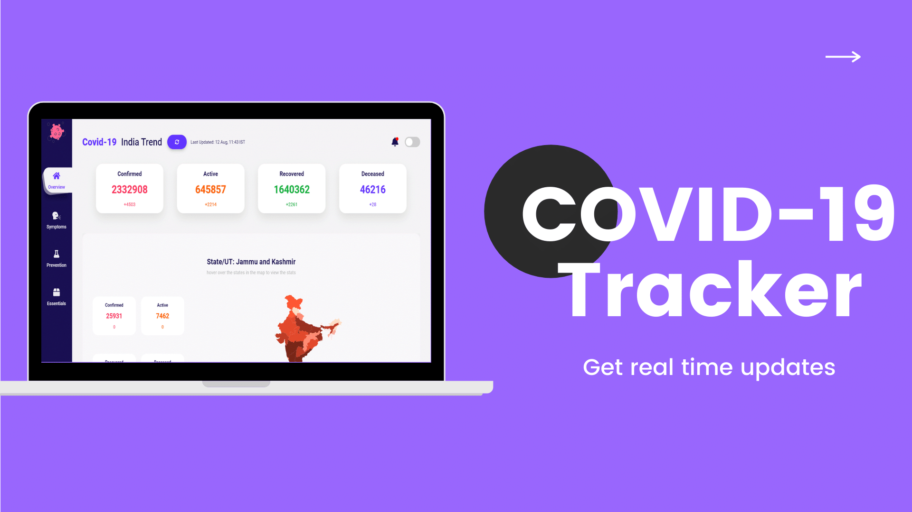

# COVID-19 Tracker

<p align="center">

</p>

<p align="center">
  View <a href="https:///">Covid-19 India Tracker</a>
</p>

## Project Setup

```
npm install
```

## Run Locally

```
npm start
```

## Contribute

Covid-19 India Tracker is an open source project. So, feel free to contribute. And if you're new to contributing to Open Source on Github, then [this guide](https://guides.github.com/activities/contributing-to-open-source/) will help you.

If you find any error or have any suggestion, feel free to create an [issue](https://github.com/yashagarwaldev).

## Credits

- Thanks, [@covid19india](https://github.com/covid19india) for the awesome [API](https://api.covid19india.org/).
- Thanks, [Drawer](https://drawer.design/products/coronavirus-icons) for the awesome Icons.

[](https://app.netlify.com/sites/competent-shannon-59b872/deploys)
